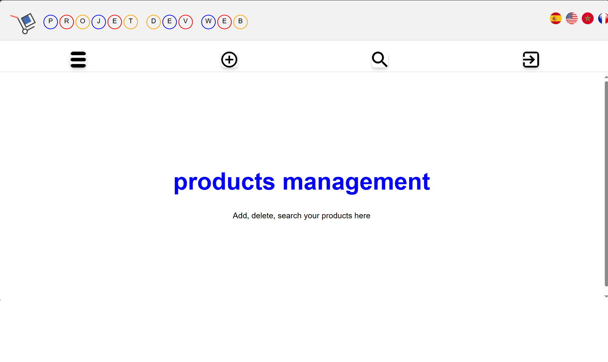

# Projet de Gestion de Stock

## Description
Ce projet est une application web de gestion de produits qui permet aux utilisateurs d'ajouter, supprimer, rechercher et modifier des produits. L'application est multilingue et prend en charge plusieurs langues, notamment le français, l'anglais, l'espagnol et l'arabe.

## Outils Utilisés
- **Langages de programmation** : PHP, HTML, CSS
- **Base de données** : MySQL
- **Serveur web** : Apache (via XAMPP)
- **IDE** : Visual Studio Code

## Fonctionnalités
- Ajouter un produit
- Supprimer un produit
- Rechercher un produit
- Modifier les informations d'un produit
- Afficher les détails d'un produit
- Multilingue (Français, Anglais, Espagnol, Arabe)

## Capture d'écran

## Base de Données
La base de données utilisée pour ce projet est `products` et contient une table `stk` avec les colonnes suivantes :

| Nom de la colonne    | Type         | Longueur/valeurs | Attributs | Null | Index   | A_I |
|----------------------|--------------|------------------|-----------|------|---------|-----|
| `ID`                 | INT          | 11               | UNSIGNED  | Non  | PRIMARY | Oui |
| `Code_Prod`          | VARCHAR      | 50               |           | Non  | UNIQUE  | Non |
| `Prod_Designiation`  | VARCHAR      | 255              |           | Non  |         | Non |
| `Prod_Prix_A`        | DECIMAL      | 10,2             |           | Non  |         | Non |
| `Prod_Marge`         | DECIMAL      | 10,2             |           | Non  |         | Non |
| `Prod_Quantity_St`   | INT          | 11               |           | Non  |         | Non |
| `Prod_Sueuil`        | INT          | 11               |           | Non  |         | Non |
| `ID_Fournisseur`     | INT          | 11               |           | Non  |         | Non |
| `imagep`             | VARCHAR      | 255              |           | Oui  |         | Non |

## Utilisation

1. Placez les fichiers dans le répertoire htdocs de votre installation XAMPP.
2. Créer la base de données products dans phpMyAdmin.
3. Démarrez Apache et MySQL via le panneau de contrôle XAMPP.
4. Accédez à l'application via http://localhost/votre-repo.
5. Accédez à la page principale (main.php)
"# gestion-Produits-app" 
"# gestion-Produits-app" 
"# gestion-Produits-app" 
